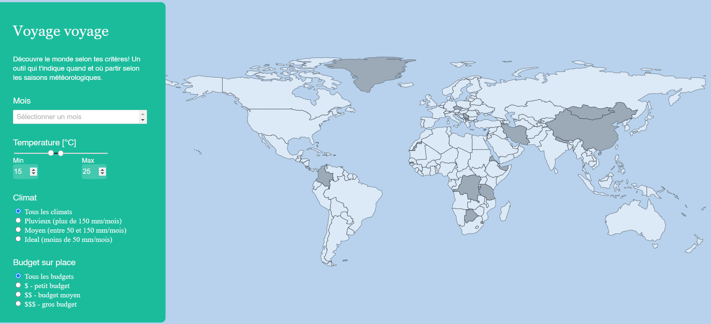

# Projet_MA_VI: Voyage voyage

Ce projet a été réalisé dans le cadre du cours de MA_Visualisation de l'Information.

Les étudiants ayant réalisé ce projet sont: BESSON Raphaël, KEMM PEREIRA Tanya, UEBELHART Calvin

### Fonctionnalités

Cette application a pour but d'inviter l'utilisateur de sélectionner différents critères (mois, température, climat, budget) et de voir quels pays sont disponibles selon ses choix.



### Données

Nos données viennent de Meteostat et Wisevoter.

### Install

```
npm intall
```

Il faut créer un fichier `.env` dans la racine du projet et mettre la clé API donnée par Meteostat

```
API_KEY = "mettre-votre-clef-ici"
BASE_URL = 'https://meteostat.p.rapidapi.com'
```

Puis faire la commande:

```
npm install dotenv-webpack --save-dev
```

Pour lancer l'application:

```
npm run start
```

Si problème lors de l'installation:

```
npm install node-fetch
```
